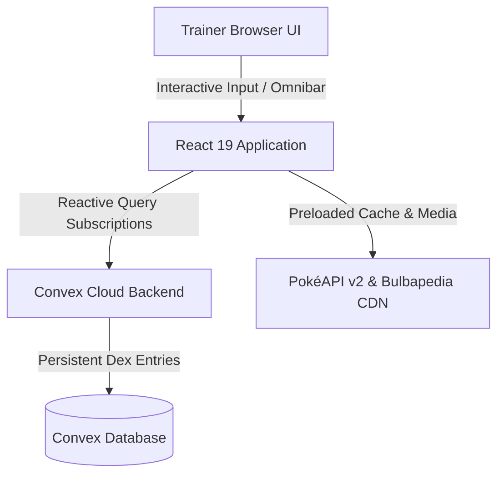

<h1 align="center">
   Pokéllects
</h1>

<p align="center">
  <strong>A permanent National Pokédex companion, rapid memory engine, and minigame discovery vault.</strong>
</p>

<p align="center">
  <a href="https://react.dev/"></a>
  <a href="https://www.typescriptlang.org/"></a>
  <a href="https://www.convex.dev/"></a>
  <a href="https://tailwindcss.com/"></a>
  <a href="https://vitejs.dev/"></a>
</p>

<p align="center">
  
  
  
</p>

---

## 📖 What is Pokéllects

Unlike typical trivia quizzes where scores and answers vanish once the browser tab closes, **Pokéllects** turns identification, memory, and trivia into a **permanent personal Pokédex ledger**.

Test your knowledge across all 9 generations, unlock entries permanently into your collection, and tackle challenges across interactive minigames designed to accelerate complete National Dex discovery.

---

## ⚡ Core Features

- 📕 **National Pokédex Explorer** — Comprehensive directory spanning 1,025 species with 9 generation tabs, dual-type filtering, search omnibar, and collectible status badges.
- ⚡ **Continuous Floating Omnibar** — Speed-focused, keyboard-first registration bar (`Esc` / `/`) that lets trainers rapidly type, submit, and inspect entries without losing focus.
- 📊 **Trainer Dashboard and Analytics** — Live regional completion progress charts, elemental affinity matrix breakdowns, and milestone achievement tracking.
- 📱 **Adaptive UI Responsiveness** — Crafted from the ground up for seamless navigation across slim smartphones, foldable devices, tablets, iPads, and ultra-wide desktop monitors.
- 🎨 **Tailored Light and Dark Themes** — Type-harmonized color system with accessible high-contrast modes, ambient glow effects, and reduced-motion support.
- ☁️ **Real-Time Cloud Persistence** — Backed by Convex for sub-millisecond reactive subscriptions, secure auth, and atomic cascading data synchronization.

---

## 📸 Screenshots

| 📕 Pokédex Vault Explorer                                              | 🎮 Interactive Minigames                                        |
| ---------------------------------------------------------------------- | --------------------------------------------------------------- |
| _Visual National Pokédex grid with 9 generations and stamp indicators_ | _Dynamic game modes drawn exclusively from undiscovered roster_ |

| 📊 Trainer Dashboard & Analytics                                 | 🔬 Biolo-gist Knowledge Mode                                    |
| ---------------------------------------------------------------- | --------------------------------------------------------------- |
| _Regional completion metrics and interactive achievement badges_ | _Bulbapedia passage comprehension with redacted identity clues_ |

---

## 🎮 Minigames

All minigames dynamically select Pokémon from your **undiscovered roster**. Successfully clearing a round directly registers that species into your personal Pokédex.

### 1. 👁️ Who's That Pokémon

The iconic silhouette recognition challenge. Study the shadow outline, note elemental type hints, and identify the mystery Pokémon before time runs out.

### 2. 🔤 Hangmon

Classic hangman letter deduction with a trainer twist. Guess letter by letter while monitoring remaining attempts, generation indicators, and unique letter counts.

### 3. 🔊 Identicry

Auditory memory challenge. Listen to authentic Pokémon sound cries sourced from the official games and type the corresponding species name.

### 4. 📜 Biolo-gist

Scientific reading comprehension. Read through authentic Bulbapedia biology descriptions with dynamically redacted species names and deduce the Pokémon from behavioral traits and habitat notes.

### 5. 🟩 Pokédle

Wordle-style numerical and categorical deduction. Guess species and receive immediate color-coded feedback on Generation, Primary Type, Secondary Type, Height, and Weight comparisons.

---

## 🛠️ Tech Stack and Architecture

### 🎨 Frontend & UI Layer

- **Framework:** React 19 + TypeScript (strict mode)
- **Styling:** Tailwind CSS v4 + Vanilla CSS Design Tokens
- **Animations & Micro-interactions:** Motion (Framer Motion) + Canvas Confetti
- **Smooth Navigation:** Lenis Smooth Scroll Provider
- **Icons & Typography:** Lucide React + Plus Jakarta Sans & Outfit fonts
- **Data Visualization:** Recharts for completion analytics and elemental breakdown charts

### ⚡ Backend & Real-Time Cloud (Convex)

- **Platform:** Convex (`convex/` reactive TypeScript serverless backend)
- **Database:** Serverless document database with transactional atomicity
- **Authentication:** `@convex-dev/auth` with credential validation
- **Real-Time Reactivity:** Reactive queries with live sub-millisecond data subscriptions
- **Cascade Handlers:** Atomic user deletion and pokedex entry cleanup mutations

### 📡 Data Pipeline & APIs

- **PokéAPI v2:** Complete 1,025 species dataset, official artwork, crying frequencies, and evolution chains
- **Bulbapedia Corpus:** Rich field literature excerpts and biological descriptions
- **Client Cache:** Dual-layer in-memory registry with instant stub lookups

### 🏗️ Architecture Flow



---

## 🚀 Getting Started

### Prerequisites

- Node.js 18.0 or newer
- npm, pnpm, or yarn

### Installation

1. **Clone the repository:**
   ```bash
   git clone https://github.com/elfinix/pokellects-web.git
   cd pokellects-web
   ```
1. **Install dependencies:**
   ```bash
   npm install
   ```
1. **Configure Environment Variables:** Create a `.env.local` file in the project root:
   ```env
   VITE_CONVEX_URL=https://your-deployment-name.convex.cloud
   VITE_CONVEX_SITE_URL=https://your-deployment-name.convex.site
   ```
1. **Start the development server:**
   ```bash
   npm run dev
   ```
1. Open http://localhost:5173 in your browser.

---

## 🌟 Points for Improvement

The following areas are actively considered for upcoming iterations:

- 🧬 **Regional Variants and Forms** — Extending the database schema to support Alolan, Galarian, Hisuian, and Paldean regional forms as distinct collectible entries.
- 🔍 **Deeper Pokémon Details** — Expanding species modals to include base stats distributions, evolution chains, movepools, and shiny sprite toggles.
- 🎯 **Additional Minigame Modes** — Developing new game formats including Type Matchup Battle Quiz, Height/Weight Balance Scale, and Silhouette Speed Run.

---

## ⚖️ Disclaimer and Credits

_Pokéllects is a fan-made, non-commercial open-source project. Pokémon and Pokémon character names, sprites, audio cries, and related media are trademarks and copyright of Nintendo, Creatures Inc., and GAME FREAK inc. Pokémon data is sourced via PokeAPI._
